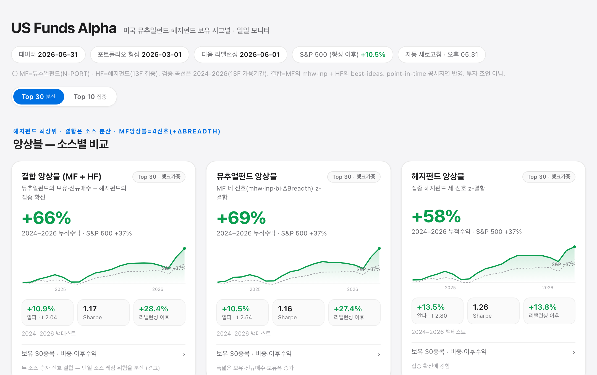

# US Funds Alpha — 미국 뮤추얼펀드 보유 공시 기반 주식 시그널 연구

미국 액티브 뮤추얼펀드의 **보유 종목 공시(SEC Form N-PORT)** 에서 체계적 주식 선택
시그널을 만들고, **공개 데이터만으로 point-in-time·팩터조정** 기준으로 정직하게 검증한
오픈소스 연구 프로젝트입니다.



<sub>밝은 톤 일일 모니터 — [전체 대시보드 스크린샷 보기](docs/dashboard.png)</sub>

> ⚠️ **투자 조언이 아닙니다.** 모든 결과는 짧은 구간(2022–2026, 약 15분기)의 in-sample
> 백테스트이며, long-only(시장베타 ≈ 1)·점추정치입니다. 과거 성과는 미래를 보장하지 않습니다.

---

## 배경 — 왜 펀드 보유 공시인가

**1. 액티브 매니저의 포지션에는 아직 가격에 반영되지 않은 정보가 있다.**
액티브 펀드 매니저가 어떤 종목을 — 얼마나 적극적으로 — 비중확대(overweight)하는지는,
시장이 아직 충분히 흡수하지 못한 견해를 담고 있는 경우가 많습니다. 이런 정보는 수 주~수 개월에
걸쳐 가격에 *점진적으로* 반영되며, 그 사이에 체계적 전략이 작동할 여지(window)가 생깁니다.

**2. 그 정보는 공개된다.** 미국 등록 펀드(뮤추얼펀드·ETF)는 SEC에 **Form N-PORT** 로 보유
종목을 공시합니다. 분기말 기준 보유가 약 **55~60일의 지연** 후 일반에 공개됩니다. 즉 우리는
매니저들이 *과거에* 무엇을 담고 줄였는지를, 지연을 두고 볼 수 있습니다.

**3. 학술적 근거.**
- **Best Ideas** (Cohen·Polk·Silli, 2010): 매니저의 *최고 확신* 종목(시장가중 대비 최대
  초과보유)이 연 2.8~4.5% 초과수익을 내며 되돌림이 없었다.
- **Active Share** (Cremers·Petajisto, 2009): 벤치마크에서 많이 벗어난(active share 높은)
  펀드가 순수익 기준 연 +1.4% 초과.

이 프로젝트는 이 아이디어를, **공개 데이터·엄격한 point-in-time·팩터조정(FF5+Momentum)**
기준으로 — 마케팅 톤 없이, 깨지면 깨지는 대로 — 검증합니다.

---

## 핵심 발견 (정직하게)

1. **유니버스 구성이 모든 것을 가른다.** 손으로 고른 대형 그로쓰 펀드 54개에서는 시그널이
   사실상 시장 베타였는데, **체계적으로 구축한 스타일 다양 액티브 미국 주식형 ~300개**
   유니버스에서는 유의한 팩터조정 알파가 됩니다. "재현 안 된다"던 초기 결론은 좁은 유니버스의
   산물이었습니다.
2. **보유 데이터를 정제해야 한다.** 단순 *평균 보유 비중* 시그널은 소수 특화 펀드가 초고비중으로
   담은 ETF·머니마켓펀드·niche MLP에 오염됩니다. 비주식 제외 + breadth(보유 펀드 수) 요건을
   걸면 헤드라인 알파가 거의 **절반(+8.4%→+4.0%)** 으로 줄고, 그 알파가 **레짐 의존적**
   (2023–26 메가캡 국면엔 작동, 2022–24엔 ≈0 — 초기 "알파"는 에너지/MLP 틸트였음)임이 드러납니다.
3. **개별 시그널은 레짐 편중, 앙상블이 가장 견고하다.** 상호보완적인 세 시그널의 z-score
   앙상블만이 **양쪽 하위기간 모두 유의**(전체 t≈4, 두 반기 모두 t>2)하며, 같은 유니버스에서
   무작위로 뽑은 포트폴리오 대비 **99~100 백분위**로 우월합니다.
4. **매니저 *선별* 은 통하지 않는다.** 직전 NAV 알파나 "신호 원천 스킬"로 펀드를 고르는 방식은
   out-of-sample에서 실패했습니다 — 스킬이 지속되지 않습니다(alpha decay). 우위가 있다면
   **종목 단위**이지 매니저 단위가 아닙니다.
5. **보유폭 *변화*(ΔBreadth)가 가장 강한 단일 신호 — 단, 비용에 갇힌다.** 문헌의 10여 가지 대안을
   검증한 결과, 보유 펀드 수의 분기간 증감(Chen–Hong–Stein)만이 기존 앙상블에 *추가로* 알파를
   줬습니다(MF long-only **+16.6%**, long-short gross **+17.2% t2.77**, 시장중립). 그러나 *변화*
   신호라 **회전율이 ~370%/년**으로 높아, 현실 비용(편도 10bp+차입 1%) 차감 후 **+14.7%**,
   고비용(25bp+)이면 t<2로 약화됩니다. 버퍼·반기·평활로 회전율을 줄이려 했으나 모두 실패 —
   **고회전은 이 신호의 본질**입니다([`notes/altsignals.md`](notes/altsignals.md)·[`ls_costs.md`](notes/ls_costs.md)).

단계별 연구 기록은 [`notes/`](notes/) 폴더(한글)에 있습니다.

---

## 시그널이란? (처음 오셨나요?)

평이하게 — 미국 액티브 펀드들이 공시한 보유 종목에서, **매니저들이 어떤 주식을 사 모으는지**를
서로 다른 각도로 잡아낸 신호입니다.

- **Mean Holding Weight** — 많은 펀드가 *크게* 담고 있는 종목 (폭넓은 고확신)
- **Large New Positions** — 여러 펀드가 *새로* 비중 있게 산 종목 (신규 매수 합의)
- **Best-Ideas** — 펀드들이 평균보다 *훨씬 더* 담은 종목 (컨센서스 대비 베팅; Cohen–Polk–Silli)
- **Reallocation** — 가격 상승분을 빼고 매니저가 *실제로 사들인* 종목 (능동적 매매)
- **ΔBreadth** — 보유 펀드 수가 *늘어나는* 종목 (신규 매수 합의의 확산; Chen–Hong–Stein 2002) — **MF 최강 단일 신호(+16.6%)**, 기존과 직교
- **앙상블** — 상호보완적 신호를 z-score로 합쳐 *가장 견고*하게 (MF는 4신호 +ΔBreadth, HF는 3신호)

각 시그널은 펀드 단위 보유 변화를 종목 단위 점수로 집계하며, **공시일(filing date) 기준
point-in-time** 이라 ~56일 공시 지연이 반영됩니다.

| 키 | 시그널 | 정의 |
|---|---|---|
| `mhw` | Mean Holding Weight | 해당 종목을 보유한 펀드들의 평균 비중 |
| `lnp` | Large New Positions | 여러 펀드의 신규 고확신 진입(≥0.5%) 비중 합 |
| `bi`  | Best-Ideas (active overweight) | Σ max(0, 펀드비중 − 전펀드평균) = 컨센서스 대비 초과보유 |
| `rlc` | Reallocation | Σ (능동 Δw / 펀드 turnover); 능동 Δw = 비중변화에서 가격 drift 제거 |
| `dbr` | ΔBreadth | (신규 보유 펀드 − 이탈 펀드) / 전체 펀드 = 분기간 보유폭 변화 (Chen–Hong–Stein) |
| `ens` | 앙상블 | MF=z(mhw·lnp·bi·dbr), HF=z(mhw·lnp·bi) 평균 → 랭크가중 top-N |

## 두 데이터 소스 — 뮤추얼펀드 vs 헤지펀드

신호는 두 소스에서 나옵니다: **뮤추얼펀드(N-PORT, ~540 액티브 US 주식형)** 와 **헤지펀드(13F 집중 매니저, ~3,100)**. 비교하면 강점이 다릅니다 — *폭넓은 보유·신규매수는 뮤추얼펀드*, *집중된 고확신(Best-Ideas)은 헤지펀드*가 우월합니다(아래 [시그널별 메커니즘](#왜-공개-정보인데-알파가-남는가--그리고-시그널마다-다른-이유) 참고). 2024–2026 구간에선 **헤지펀드 앙상블이 최상위(+13.5%, t2.80)**, 두 소스 승자 신호를 합친 **결합 앙상블(MF의 mhw·lnp + HF의 best-ideas)** 은 +10.9%(t2.0)로, *단일 소스 레짐 위험을 분산*하는 견고한 선택입니다.

## 핵심 결과 (정제 유니버스, 랭크가중 top30, FF5+Mom 알파, Newey-West)

| 전략 | 알파 | t | Sharpe | 2022-24 | 2024-26 |
|---|---|---|---|---|---|
| **앙상블 (MHW·LNP·BI)** | +6.5% | **3.81** | 1.65 | t2.4 | t4.1 |
| Best-Ideas (active OW) | +6.8% | 3.36 | 1.94 | t3.4 | t1.1 |
| Reallocation (능동 매매) | +7.0% | 2.01 | 1.50 | t3.0 | t1.6 |
| Mean Holding Weight | +6.0% | 2.92 | 2.00 | – | – |
| Large New Positions | +4.9% | 1.46 | 1.56 | t3.8 | t0.7 |
| S&P 500 (SPY) | −0.1% | – | 1.41 | | |

거래비용은 낮습니다(분기 편도 회전율 ~16–19%). 25bp 차감 후에도 알파는 거의 변하지 않습니다.
비중 방식도 영향을 줍니다 — 랭크가중이 알파/견고성 최고, 역변동성이 Sharpe 최고, 동일가중이 가장
단순합니다([`notes/validate.md`](notes/validate.md)).

---

## 왜 공개 정보인데 알파가 남는가 — 그리고 시그널마다 다른 이유

세미-스트롱 효율적 시장(Fama)이면 *공시된 공개 정보*는 이미 가격에 반영돼 알파가 없어야 합니다.
그런데 남습니다. 시장이 비효율적이어서가 아니라, **네 가지 마찰이 겹쳐 알파가 "결함"이 아니라
"균형 보상"으로 존재**하기 때문입니다:

1. **정보 처리 비용** — Grossman·Stiglitz(1980): 가격이 모든 정보를 *공짜로* 반영하면 아무도
   정보를 모을 유인이 없다 → 균형엔 정보를 가공·실행하는 자에게 갈 초과수익이 *반드시* 남는다.
   (공시를 긁어 매핑·정제·시그널화하는 비용 자체가 그 일부.)
2. **느린 정보 확산** — Hong·Stein(1999), Hong·Lim·Stein(2000): 펀더멘털은 가격에 *점진적으로*
   스며든다. 공시 지연(N-PORT ~56일·13F ~45일)조차 확산의 끝물 안에 일부 든다. 분석가 커버리지가
   적은(under-followed) 종목일수록 알파가 크다.
3. **Best-Ideas 조직론** — Cohen·Polk·Silli(2010): 스킬은 실재하나 매니저의 *최고확신*에 응축돼
   있고(연 2.8~4.5% 초과), 매니저는 그것을 희석한다. 공시는 "어느 게 고확신인지"를 드러낸다.
4. **차익거래의 한계** — Shleifer·Vishny(1997), Stein(2009): 차익거래자는 *남의 돈으로* 한다.
   단기 미스프라이싱 확대·환매·벤치마킹 압력 때문에 집중·특이위험 포지션을 끝까지 못 떠안는다
   → 그 위험프리미엄이 알파처럼 보인다.

**그런데 이 마찰들은 시그널마다 다르게 작동합니다.** 우리 실측(2024–2026, 13F 가용구간,
랭크가중 top30, FF5+Mom α)이 이를 깔끔히 보여줍니다 — *이론이 어느 시그널이 왜 사는지까지 설명*합니다:

| 시그널 | 잡는 것 | 뮤추얼펀드 | 헤지펀드 | 한 줄 이유 |
|---|---|---|---|---|
| **Best-Ideas** | 컨센서스 대비 *확신 수준* | +3.2% (약) | **+11.7%** (강) | 확신은 조직 제약이 약한 곳에서만 드러난다 |
| **Large New Pos** | *갓 형성된* 확신 | **+15.9%** | +11.9% | 가장 신선 → 확산 윈도우 초입 |
| **Mean Holding Wt** | *폭넓은* 합의 | +7.0% (안정) | +0.1% (무) | breadth는 보유 겹침이 큰 MF에서만 성립 |
| **Reallocation** | 분기간 *매매·타이밍* | −2.2% | **−6.5%** | 지연·평균회귀·측정오차 → 누구도 못 먹음 |

**① 왜 Best-Ideas는 헤지펀드에서만 강한가 — 조직 제약의 차이.**
Cohen·Polk·Silli의 핵심은 "알파는 고확신에 있고, 매니저는 그걸 희석한다"입니다. *얼마나 희석되는가는
조직 제약에 달렸습니다.* 뮤추얼펀드는 **분산 의무(1940년법·RIC 세제의 5/10/40 룰)·추적오차
예산·closet indexing**(Cremers·Petajisto의 낮은 Active Share)으로 확신이 *제도적으로 눌리고*,
컨센서스(전펀드평균)가 메가캡 인덱스 보유에 지배돼 "초과보유" 신호가 무뎌집니다 → mf_bi 약함(+3.2%).
헤지펀드는 **분산 의무 없음·집중 북·높은 Active Share·성과보수(2&20)가 집중을 보상** → 집중
매니저의 초과보유는 *희석되지 않은 진짜 확신*입니다. 우리의 집중 필터(15–80종목·top10≥40%)가
바로 "조직 제약이 가장 약한 매니저"를 골라냅니다 → hf_bi 강함(+11.7%).

**② 왜 Mean Holding Weight는 정반대인가 — breadth vs 집중.**
mhw="많은 펀드가 크게 보유"=폭넓은 합의(breadth). 뮤추얼펀드(~540, 분산·겹침 큼)에선 고-mhw가
*제약받는 다수 매니저의 교집합 확신* = 노이즈 상쇄된 wisdom-of-crowds → 안정(+7.0%). 헤지펀드
(집중·특이·겹침 적음)에선 "여러 집중 펀드가 같은 종목을 크게"가 드물고, 생기면 *crowded trade* →
동시 청산 위험(Stein 2009 unwinding, Lou·Polk *comomentum*) → hf_mhw≈0. breadth 신호는 보유가
겹치는 소스에서만 의미를 갖습니다.

**③ 왜 Reallocation은 양쪽 다 약하고 헤지펀드에서 더 나쁜가 — 수준 vs 타이밍.**
앞의 셋은 보유 *수준(level=확신)* 을 잡지만, rlc는 분기간 *변화(timing=매매)* 를 잡습니다.
한계차익거래·느린확산 이론이 예측하는 건 *확신 수준이 가격을 예측*한다는 것이지 *공개된 과거
매매가 미래를 예측*한다는 게 아닙니다. ⑴ 분기 스냅샷+45–56일 지연이면 매매 타이밍은 *이미 소진*되고
(확산 윈도우 닫힘), ⑵ 분기간 비중 변화는 *평균회귀*하며(flow 거래의 되돌림: Coval·Stafford,
Wermers 2003), ⑶ 13F는 *롱 포지션의 분기말 스냅샷만* 보여줘 라운드트립을 놓치므로 *측정오차*가
큽니다. 헤지펀드가 더 나쁜 이유 — 더 빈번·전술적으로 매매해 reallocation이 더 빨리 소진된 고빈도
노이즈이기 때문(고회전 매니저보다 *장기 시계 매니저*를 골라야 한다는 실무 통설과 일치). 그래서
우리는 rlc를 앙상블에서 뺐습니다.

> **한 줄로** — 작동하는 시그널은 *조직 제약이 약한 곳에서 드러난, 희석되지 않은 **확신 수준***을
> 잡고(갓 형성됐을 때 lnp, 집중 매니저일 때 hf_bi), 실패하는 시그널은 지연·평균회귀·측정오차에
> 노출된 **매매 타이밍**(rlc)을 잡습니다. **알파의 정체는 "공짜 점심"이 아니라, 특이위험·제도적
> 마찰을 떠안는 자에게 가는 균형 보상**이며 — 그래서 자본이 몰리면 감쇠합니다(13F의 초과수익은
> 2008년 이후 유의하게 약화). 우리 백테스트가 보여준 *레짐 의존·비용 민감·팩터 일부*라는 모습이
> 바로 이 이론과 부합합니다.

<sub>학술 출처 — Grossman & Stiglitz (1980) *On the Impossibility of Informationally Efficient
Markets*; Hong & Stein (1999), Hong·Lim·Stein (2000) 느린 정보확산; Cohen·Polk·Silli (2010)
[*Best Ideas*](https://personal.lse.ac.uk/polk/research/bestideas.pdf); Cremers·Petajisto (2009)
*Active Share*; Shleifer & Vishny (1997) [*The Limits of Arbitrage*](https://people.umass.edu/kazemi/871/Limits%20to%20arbitrage.pdf);
Stein (2009) *Sophisticated Investors and Market Efficiency*; Lou·Polk *Comomentum*; Coval·Stafford
(2007) *Asset Fire Sales*; Wermers (2003); 13F 공시·복제 비용 — [*Does Portfolio Disclosure Make
Money Smarter?*](https://mues.econ.muni.cz/media/3528254/13f_smart_money.pdf),
[Quantpedia *Alpha Cloning*](https://quantpedia.com/strategies/alpha-cloning-following-13f-fillings).</sub>

---

## 라이브 대시보드

자체 완결형 일일 모니터(`dashboard/index.html`, 밝은 톤 UI)는 네 구역으로 구성됩니다 —
**① 앙상블 소스별 비교**(결합·뮤추얼펀드·헤지펀드), **② 뮤추얼펀드 유니버스 · 개별 시그널**
(mhw·lnp·bi·rlc·**ΔBreadth**), **③ 헤지펀드 유니버스 · 개별 시그널**,
**④ 시장중립 — ΔBreadth Long-Short**(롱=보유폭↑ / 숏=보유폭↓, 베타≈0). 각 카드에 2024–2026
누적수익 vs S&P 500 차트, 검증 통계(알파·t·Sharpe), 리밸런싱 이후 실시간 성과, 종목별 **비중**·
이후수익을 표시하고(상단 Top 10/30 토글), 하단에 시그널·소스 설명을 담았습니다. ④ 시장중립
카드는 gross 헤드라인과 함께 **비용 차감 후 순알파(~+14%)·회전율 한계**를 명시합니다.

```bash
cd dashboard && python3 -m http.server 8769   # → http://localhost:8769/
```

`launchd` 에이전트(`scripts/daily_update.sh`)가 매 영업일 아침 자동 갱신합니다 —
두 소스의 신규 공시를 증분 수집(`update_filings.py all`: 펀드별 새 N-PORT + 매니저별 새
13F-HR을 패널의 마지막 공시일 이후만 다운로드)하고 라이브 포트폴리오를 재가격
(`dashboard_data.py`)합니다. 검증 통계는 `compute_card_stats.py`가 미리 산출합니다.

---

## 재현 방법

```bash
pip install -r requirements.txt

# 1. 유니버스 구축 (N-CEN 플래그 + N-PORT EC% 확정)
python3 scripts/build_master_universe.py     # → data/universe_master.parquet
python3 scripts/stage2_ecpct.py              # → data/universe_confirmed.parquet
python3 scripts/expand_validate.py           # NAV/스타일 → data/universe_300.json + PCA

# 2. 보유·가격 수집 (두 소스)
python3 scripts/bulk_collect_300.py universe_541.json holdings_panel_541.parquet  # MF N-PORT 벌크
python3 scripts/f13_collect.py               # HF 13F 벌크 → data/f13_panel.parquet
python3 scripts/fetch_prices_300.py          # OpenFIGI + Yahoo → data/prices_full.parquet

# 3. 검증
python3 scripts/validate.py                  # 신호군·정제·앙상블·비중·MHW비용 (signals|revalid|ensemble|weighting|mhwcost)
python3 scripts/universe_research.py         # 코호트·300vs541·breadth 포화곡선 (cohort|compare|breadth)
python3 scripts/altsignals.py                # 문헌 기반 대안 시그널 10종 + 증분α
python3 scripts/ls_analysis.py [costs|buffer]  # ΔBreadth L/S 비용 민감도 · 회전율 절감 시도
python3 scripts/reallocation.py              # Reallocation 정의탐색 + R3 검증
python3 scripts/f13_analysis.py              # 13F 정밀선별·breadth·MF비교·결합
python3 scripts/activist_research.py event   # SC 13D 이벤트 스터디 (collect|signal|event)

# 4. 대시보드
python3 scripts/compute_card_stats.py        # → dashboard/card_stats.json
python3 scripts/dashboard_data.py            # → dashboard/data.json
```

대용량 데이터(parquet, SEC·가격 캐시)는 git에서 제외되며 위 스크립트로 재생성됩니다. 소형
reference 입력(`data/raw/*.json`, 팩터 CSV, `data/universe_300.json`)은 커밋되어 있습니다.

## 저장소 구조

```
scripts/
  falib.py             공유 라이브러리 (팩터·패널·시그널·FF알파) — 모든 스크립트가 사용
  build_master_universe.py, stage2_ecpct.py, expand_validate.py   MF 유니버스 구축
  bulk_collect_300.py, fetch_prices_300.py                        MF N-PORT·가격 수집
  f13_collect.py, f13_analysis.py                                 HF 13F 수집·분석(정밀선별·breadth·비교·결합)
  update_filings.py                                               일일 증분 (MF 541 + HF 13F)
  validate.py, universe_research.py, reallocation.py                 검증·유니버스·재배분 분석
  altsignals.py, ls_analysis.py                                   대안 시그널 · ΔBreadth L/S(비용·버퍼)
  sc13d_collect.py, sc13d_monitor.py, activist_research.py         13D 수집·일일모니터·이벤트연구
  compute_card_stats.py, dashboard_data.py, daily_update.sh        대시보드 파이프라인
dashboard/             자체 완결형 HTML 모니터 + JSON 데이터
notes/                 단계별 연구 기록 (한글)
```

## 데이터 소스 (모두 무료)

- **SEC EDGAR** — Form N-PORT(뮤추얼펀드 보유) · N-CEN(펀드 메타데이터·인덱스펀드 플래그) ·
  Form 13F-HR(헤지펀드/기관 보유), DERA 구조화 벌크 데이터셋 + 일일 증분(submissions API) 포함.
- **Yahoo Finance** — 일별 수정주가 및 펀드 NAV.
- **OpenFIGI** — CUSIP → 티커 매핑.
- **Ken French Data Library** — Fama-French 5팩터 + 모멘텀.

## 한계 / 면책

- in-sample(2022–2026, ~15분기)·단일 가격 레짐·점추정치. 주요 전략은 long-only(시장베타 ≈ 1)이며,
  유일한 시장중립 전략(ΔBreadth L/S)은 **회전율 ~370%/년**이라 비용에 민감(net ~+14% @10bp+1%,
  고비용이면 t<2) — 저비용 집행자에 한정.
- 공시 지연(~56일) 및 알파 감쇠(decay)는 라이브로 계속 모니터링해야 합니다.
- 본 저장소는 연구·교육 목적이며 **투자 조언이 아닙니다.**

## 라이선스

[MIT](LICENSE).
