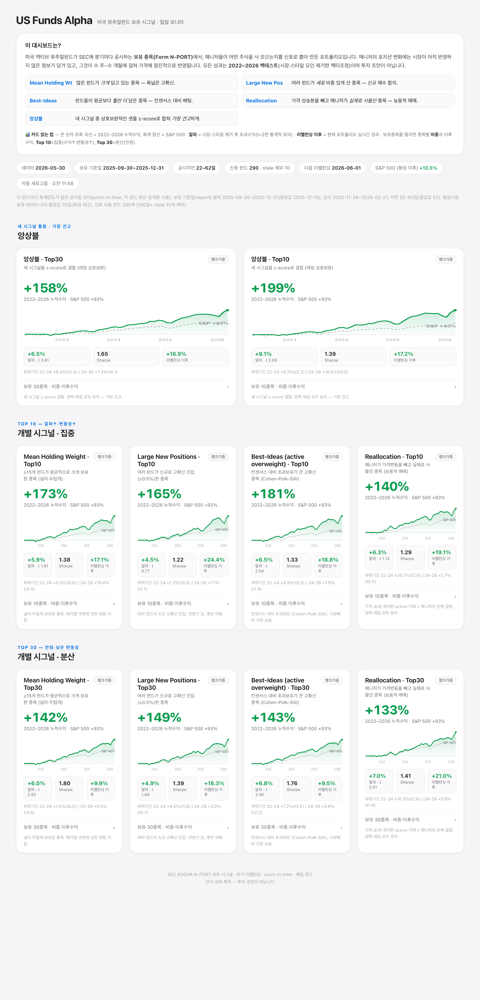

# US Funds Alpha — 미국 뮤추얼펀드 보유 공시 기반 주식 시그널 연구

미국 액티브 뮤추얼펀드의 **보유 종목 공시(SEC Form N-PORT)** 에서 체계적 주식 선택
시그널을 만들고, **공개 데이터만으로 point-in-time·팩터조정** 기준으로 정직하게 검증한
오픈소스 연구 프로젝트입니다.



> ⚠️ **투자 조언이 아닙니다.** 모든 결과는 짧은 구간(2022–2026, 약 15분기)의 in-sample
> 백테스트이며, long-only(시장베타 ≈ 1)·점추정치입니다. 과거 성과는 미래를 보장하지 않습니다.

---

## 배경 — 왜 펀드 보유 공시인가

**1. 액티브 매니저의 포지션에는 아직 가격에 반영되지 않은 정보가 있다.**
액티브 펀드 매니저가 어떤 종목을 — 얼마나 적극적으로 — 비중확대(overweight)하는지는,
시장이 아직 충분히 흡수하지 못한 견해를 담고 있는 경우가 많습니다. 이런 정보는 수 주~수 개월에
걸쳐 가격에 *점진적으로* 반영되며, 그 사이에 체계적 전략이 작동할 여지(window)가 생깁니다.

**2. 그 정보는 공개된다.** 미국 등록 펀드(뮤추얼펀드·ETF)는 SEC에 **Form N-PORT** 로 보유
종목을 공시합니다. 분기말 기준 보유가 약 **55~60일의 지연** 후 일반에 공개됩니다. 즉 우리는
매니저들이 *과거에* 무엇을 담고 줄였는지를, 지연을 두고 볼 수 있습니다.

**3. 학술적 근거.**
- **Best Ideas** (Cohen·Polk·Silli, 2010): 매니저의 *최고 확신* 종목(시장가중 대비 최대
  초과보유)이 연 2.8~4.5% 초과수익을 내며 되돌림이 없었다.
- **Active Share** (Cremers·Petajisto, 2009): 벤치마크에서 많이 벗어난(active share 높은)
  펀드가 순수익 기준 연 +1.4% 초과.

이 프로젝트는 이 아이디어를, **공개 데이터·엄격한 point-in-time·팩터조정(FF5+Momentum)**
기준으로 — 마케팅 톤 없이, 깨지면 깨지는 대로 — 검증합니다.

---

## 핵심 발견 (정직하게)

1. **유니버스 구성이 모든 것을 가른다.** 손으로 고른 대형 그로쓰 펀드 54개에서는 시그널이
   사실상 시장 베타였는데, **체계적으로 구축한 스타일 다양 액티브 미국 주식형 ~300개**
   유니버스에서는 유의한 팩터조정 알파가 됩니다. "재현 안 된다"던 초기 결론은 좁은 유니버스의
   산물이었습니다.
2. **보유 데이터를 정제해야 한다.** 단순 *평균 보유 비중* 시그널은 소수 특화 펀드가 초고비중으로
   담은 ETF·머니마켓펀드·niche MLP에 오염됩니다. 비주식 제외 + breadth(보유 펀드 수) 요건을
   걸면 헤드라인 알파가 거의 **절반(+8.4%→+4.0%)** 으로 줄고, 그 알파가 **레짐 의존적**
   (2023–26 메가캡 국면엔 작동, 2022–24엔 ≈0 — 초기 "알파"는 에너지/MLP 틸트였음)임이 드러납니다.
3. **개별 시그널은 레짐 편중, 앙상블이 가장 견고하다.** 상호보완적인 세 시그널의 z-score
   앙상블만이 **양쪽 하위기간 모두 유의**(전체 t≈4, 두 반기 모두 t>2)하며, 같은 유니버스에서
   무작위로 뽑은 포트폴리오 대비 **99~100 백분위**로 우월합니다.
4. **매니저 *선별* 은 통하지 않는다.** 직전 NAV 알파나 "신호 원천 스킬"로 펀드를 고르는 방식은
   out-of-sample에서 실패했습니다 — 스킬이 지속되지 않습니다(alpha decay). 우위가 있다면
   **종목 단위**이지 매니저 단위가 아닙니다.

단계별 연구 기록은 [`notes/`](notes/) 폴더(한글)에 있습니다.

---

## 시그널이란? (처음 오셨나요?)

평이하게 — 미국 액티브 펀드들이 공시한 보유 종목에서, **매니저들이 어떤 주식을 사 모으는지**를
서로 다른 각도로 잡아낸 신호입니다.

- **Mean Holding Weight** — 많은 펀드가 *크게* 담고 있는 종목 (폭넓은 고확신)
- **Large New Positions** — 여러 펀드가 *새로* 비중 있게 산 종목 (신규 매수 합의)
- **Best-Ideas** — 펀드들이 평균보다 *훨씬 더* 담은 종목 (컨센서스 대비 베팅; Cohen–Polk–Silli)
- **Reallocation** — 가격 상승분을 빼고 매니저가 *실제로 사들인* 종목 (능동적 매매)
- **앙상블** — 상호보완적인 셋(MHW·LNP·BI)을 z-score로 합쳐 *가장 견고*하게

각 시그널은 펀드 단위 보유 변화를 종목 단위 점수로 집계하며, **공시일(filing date) 기준
point-in-time** 이라 ~56일 공시 지연이 반영됩니다.

| 키 | 시그널 | 정의 |
|---|---|---|
| `mhw` | Mean Holding Weight | 해당 종목을 보유한 펀드들의 평균 비중 |
| `lnp` | Large New Positions | 여러 펀드의 신규 고확신 진입(≥0.5%) 비중 합 |
| `bi`  | Best-Ideas (active overweight) | Σ max(0, 펀드비중 − 전펀드평균) = 컨센서스 대비 초과보유 |
| `rlc` | Reallocation | Σ (능동 Δw / 펀드 turnover); 능동 Δw = 비중변화에서 가격 drift 제거 |
| `ens` | 앙상블 | z(mhw) + z(lnp) + z(bi) 평균 → 랭크가중 top-N |

## 핵심 결과 (정제된 300펀드 유니버스, 랭크가중 top30, FF5+Mom 알파, Newey-West)

| 전략 | 알파 | t | Sharpe | 2022-24 | 2024-26 |
|---|---|---|---|---|---|
| **앙상블 (MHW·LNP·BI)** | +6.5% | **3.81** | 1.65 | t2.4 | t4.1 |
| Best-Ideas (active OW) | +6.8% | 3.36 | 1.94 | t3.4 | t1.1 |
| Reallocation (능동 매매) | +7.0% | 2.01 | 1.50 | t3.0 | t1.6 |
| Mean Holding Weight | +6.0% | 2.92 | 2.00 | – | – |
| Large New Positions | +4.9% | 1.46 | 1.56 | t3.8 | t0.7 |
| S&P 500 (SPY) | −0.1% | – | 1.41 | | |

거래비용은 낮습니다(분기 편도 회전율 ~16–19%). 25bp 차감 후에도 알파는 거의 변하지 않습니다.
비중 방식도 영향을 줍니다 — 랭크가중이 알파/견고성 최고, 역변동성이 Sharpe 최고, 동일가중이 가장
단순합니다([`notes/weighting.md`](notes/weighting.md)).

---

## 라이브 대시보드

자체 완결형 일일 모니터(`dashboard/index.html`, 밝은 톤 UI)는 세 묶음으로 구성됩니다 —
**앙상블**(Top10·Top30), **개별 시그널 · 집중**(Top10), **개별 시그널 · 분산**(Top30).
각 카드에 2022–2026 누적수익 vs S&P 500 차트, 검증 통계(알파·t·Sharpe), 리밸런싱 이후 실시간
성과, 공시지연 분포, 종목별 **비중**·이후수익, 리밸런싱 교체 알림을 표시하고, 상단에 시그널
설명을 담았습니다.

```bash
cd dashboard && python3 -m http.server 8769   # → http://localhost:8769/
```

`launchd` 에이전트(`scripts/daily_update.sh`)가 매 영업일 아침 자동 갱신합니다 —
신규 공시 N-PORT를 증분 수집(`update_filings.py`)하고 라이브 포트폴리오를 재가격
(`dashboard_data.py`)합니다. 검증 통계는 `compute_card_stats.py`가 미리 산출합니다.

---

## 재현 방법

```bash
pip install -r requirements.txt

# 1. 유니버스 구축 (N-CEN 플래그 + N-PORT EC% 확정)
python3 scripts/build_master_universe.py     # → data/universe_master.parquet
python3 scripts/stage2_ecpct.py              # → data/universe_confirmed.parquet
python3 scripts/expand_validate.py           # NAV/스타일 → data/universe_300.json + PCA

# 2. 보유·가격 수집
python3 scripts/bulk_collect_300.py          # N-PORT 벌크 → data/holdings_panel_300.parquet
python3 scripts/fetch_prices_300.py          # OpenFIGI + Yahoo → data/prices_full.parquet

# 3. 검증
python3 scripts/signals_family.py            # 전 신호군, 동일 유니버스
python3 scripts/revalidate_clean.py          # 정제 신호 + 하위기간 + 플라시보
python3 scripts/ensemble_test.py             # 3-신호 앙상블
python3 scripts/weighting_test.py            # 비중 방식
python3 scripts/mhw_cost.py                  # 거래비용 민감도

# 4. 대시보드
python3 scripts/compute_card_stats.py        # → dashboard/card_stats.json
python3 scripts/dashboard_data.py            # → dashboard/data.json
```

대용량 데이터(parquet, SEC·가격 캐시)는 git에서 제외되며 위 스크립트로 재생성됩니다. 소형
reference 입력(`data/raw/*.json`, 팩터 CSV, `data/universe_300.json`)은 커밋되어 있습니다.

## 저장소 구조

```
scripts/
  falib.py             공유 라이브러리 (팩터·패널·시그널·FF알파) — 모든 스크립트가 사용
  build_master_universe.py, stage2_ecpct.py, expand_validate.py   유니버스 구축
  bulk_collect_300.py, fetch_prices_300.py, update_filings.py      데이터 수집
  signals_family.py, revalidate_clean.py, ensemble_test.py,
  weighting_test.py, reallocation_validate.py, mhw_cost.py            검증
  compute_card_stats.py, dashboard_data.py, daily_update.sh        대시보드 파이프라인
dashboard/             자체 완결형 HTML 모니터 + JSON 데이터
notes/                 단계별 연구 기록 (한글)
```

## 데이터 소스 (모두 무료)

- **SEC EDGAR** — Form N-PORT(월별 포트폴리오 보유) & N-CEN(펀드 메타데이터·인덱스펀드 플래그),
  DERA 구조화 벌크 데이터셋 포함.
- **Yahoo Finance** — 일별 수정주가 및 펀드 NAV.
- **OpenFIGI** — CUSIP → 티커 매핑.
- **Ken French Data Library** — Fama-French 5팩터 + 모멘텀.

## 한계 / 면책

- in-sample(2022–2026, ~15분기)·단일 가격 레짐·long-only(시장베타 ≈ 1)·점추정치.
- 공시 지연(~56일) 및 알파 감쇠(decay)는 라이브로 계속 모니터링해야 합니다.
- 본 저장소는 연구·교육 목적이며 **투자 조언이 아닙니다.**

## 라이선스

[MIT](LICENSE).
